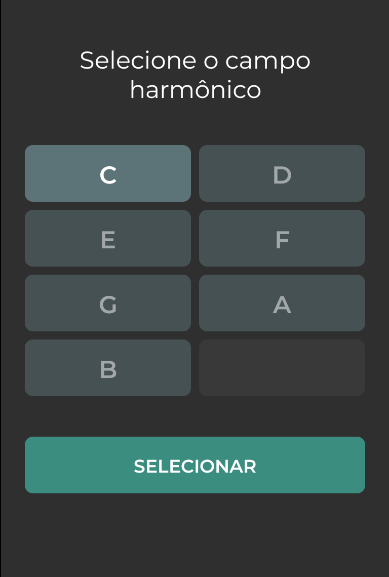
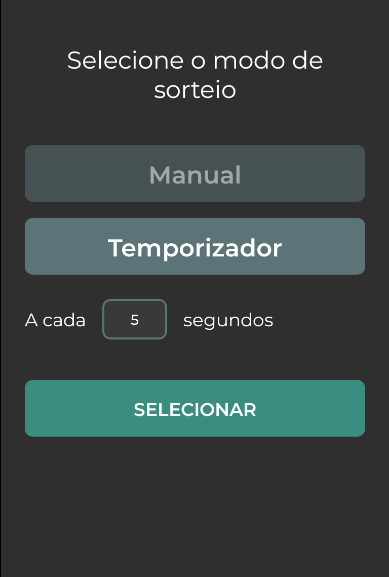
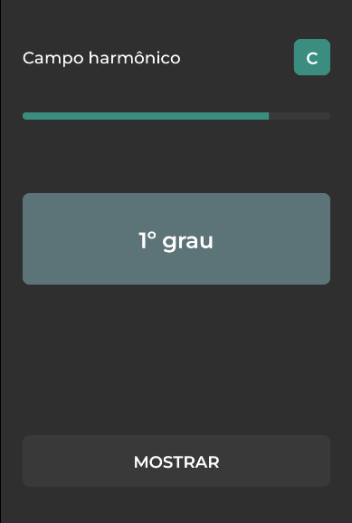
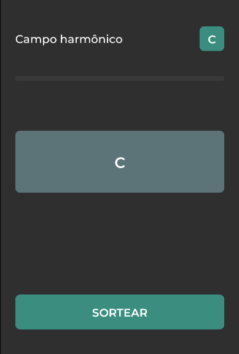

# Campo Harmônico

## Capturas de tela

| Campo harmônico | Modo de sorteio |
| --- | --- |
|  |  |

| Sorteio | Resposta |
| --- | --- |
|  |  |

## Como executar

1. Clone o repositório

```bash
git clone https://github.com/filipealvess/campo-harmonico.git
```

2. Instale as dependências

> Use a versão do NodeJS que está no arquivo [`.node-version`](./.node-version)

```bash
npm install
```

3. Execute a aplicação

```bash
npm start
```

4. Abra a aplicação no seu celular (Expo GO) ou em um emulador Android
